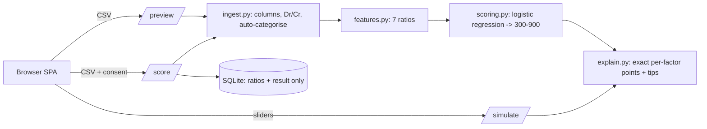

# CreditLens: pitch kit

## One sentence
An explainable credit score for students and gig workers with no credit history: upload a bank or UPI
statement, see exactly which habits raised or lowered the score, and test "what if" changes before making them.

## The problem
Around the world, millions of young and informal workers are "credit invisible": no bureau history, so no
loan, even when their cash-flow habits are healthy. Existing alternatives are black boxes: a rejection with no reason
and nothing the person can do about it.

## What we built
1. **Reads real statements.** Typical bank/UPI CSV exports work as they are (different column names, separate
   debit/credit columns, Dr/Cr markers, junk lines above the header). Rows are categorised from their description
   and the user sees, and can check, how the file was understood *before* scoring.
2. **Seven behaviour ratios**, not income: income consistency, share of income saved, on-time bills, rent-to-income,
   EMI burden, spending volatility, months of history.
3. **A score on a 300-900 scale** from a standardised logistic regression, so each factor's contribution is
   **exact** (the linear-model case of SHAP). A test proves the points add up to the score.
4. **Plain-language reasons and tips**, with each tip's "+N points" computed by re-scoring with the real model.
5. **What-if simulator** with live sliders, **score history + compare**, and a **printable report**.

## Why it is trustworthy
| Concern | What we did |
|---|---|
| Fairness | No sensitive attributes. Absolute income is not a feature; a test shows scaling all amounts changes nothing. Coefficients are sign-constrained (a feature can never be shown helping when it should hurt). |
| Privacy | The raw statement is never stored, only 7 ratios + result. Consent is required on every upload. One click erases results or the whole account. |
| Honesty | The model is trained on **synthetic** data and says so on every screen and API response. The reported AUC (~0.77) measures recovery of the generator's assumptions, not real-world repayment. |
| Security | PBKDF2 passwords, JWT, strong password rules, rate-limited auth, per-user data isolation (tested). |
| Quality | 50+ automated tests across features, scoring, API, ingestion and auth. |

## Architecture

## 3-minute demo script
1. (0:00) "Meet Asha, a student with no credit history." Open the site, click **Try the demo**.
2. (0:20) Choose **Bank-style export**. Point at the preview: "It understood a real bank format, found the
   columns, and categorised 84 rows automatically. She can check this before anything is scored."
3. (0:50) Tick consent, **Get my score**. Explain the gauge, then the factor bars: "Every point is accounted for."
4. (1:30) Scroll to the tips: "Pay bills on time: +113 points, computed by the real model."
5. (1:50) Move the **on-time payments** slider to 100%: the score and band change live.
6. (2:20) **History > compare**: "Here is the same person three months later and exactly what moved."
7. (2:40) **Print / save as PDF**, then privacy: "Raw statements are never stored; she can erase everything."
8. (2:50) Close with the limitation: "Synthetic data today; the pipeline is ready for real repayment data."

## Slide outline (8 slides)
1. Title + one sentence  2. The problem (credit-invisible people)  3. Our approach (behaviour ratios, not income)
4. Product tour (3 screenshots from `docs/screens/`)  5. How explainability works (exact points + tips + what-if)
6. Trust: fairness, privacy, security, tests  7. Architecture diagram  8. Limits + roadmap

## Likely judge questions
* **"Is the score real?"** No. It is a demo trained on synthetic data and clearly labelled. The value is the explainable pipeline and UX.
* **"How is it different from a bureau score?"** It needs no history and tells you why. Bureau scores need loans first.
* **"Could it be biased?"** It never sees identity or income level, only ratios; we state the remaining risk (e.g. rent share can correlate with city).
* **"What would real data change?"** Retrain `app/ml/train.py` on repayment outcomes; every other layer stays the same.
* **"Why logistic regression?"** Exact, auditable explanations that regulators and users can understand.

## Roadmap
Real repayment data and calibration; account-aggregator (consent-based bank data) instead of CSV; Hindi and regional
languages; PostgreSQL; refresh tokens; fairness audit by segment.
