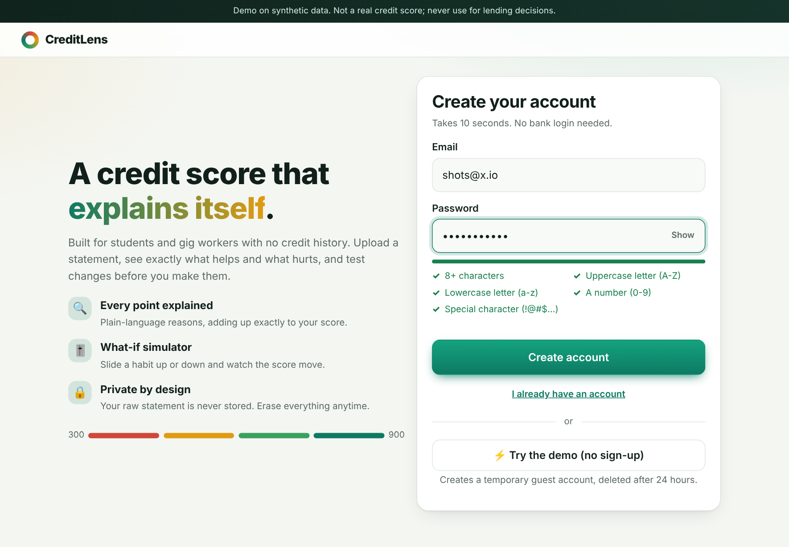
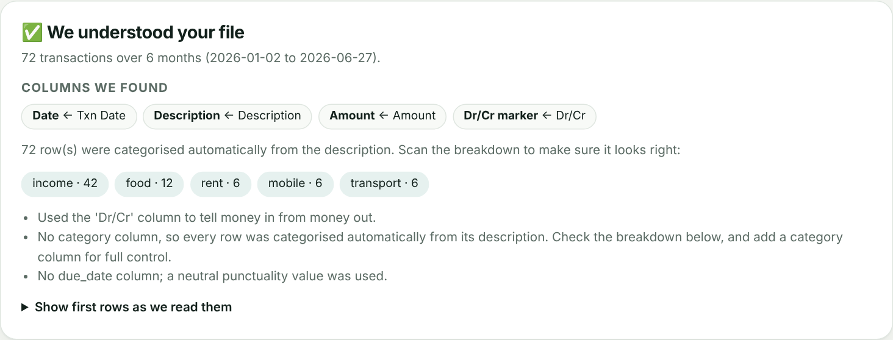
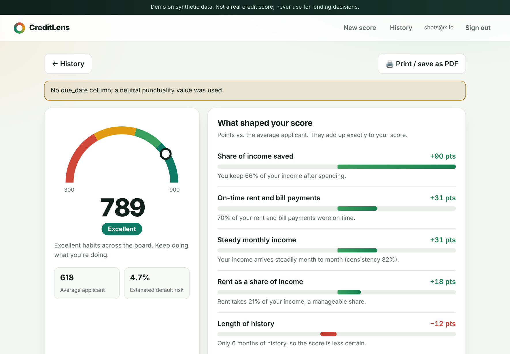
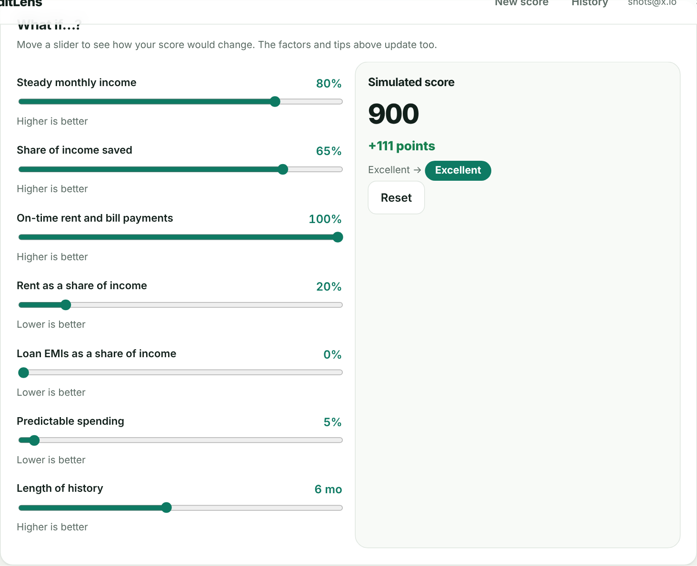
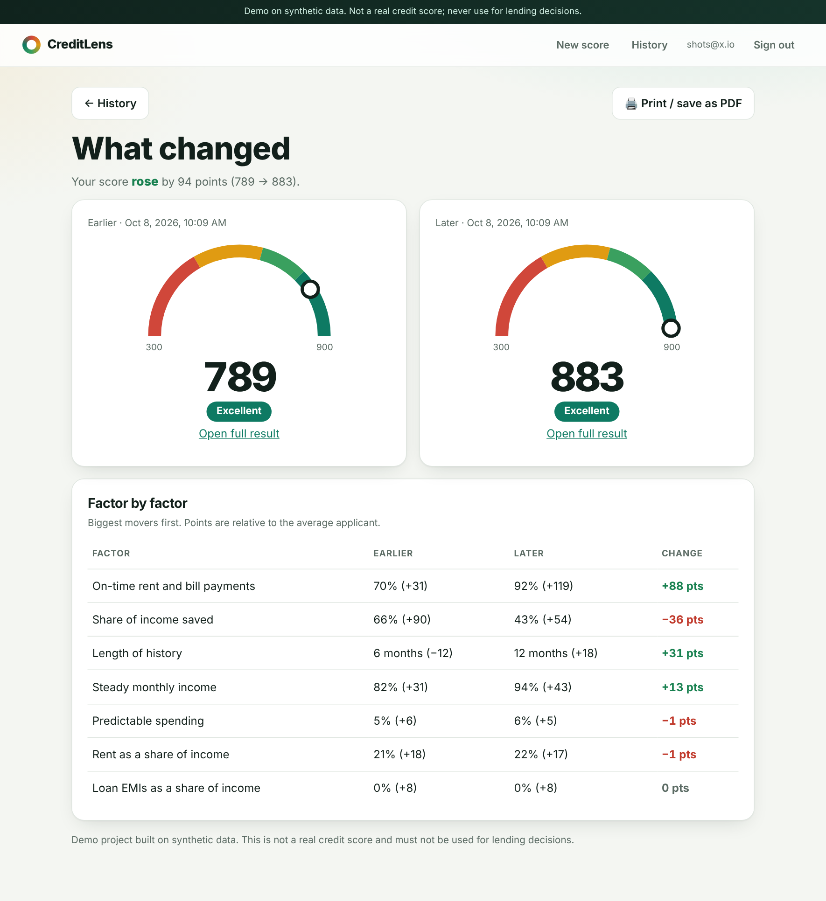
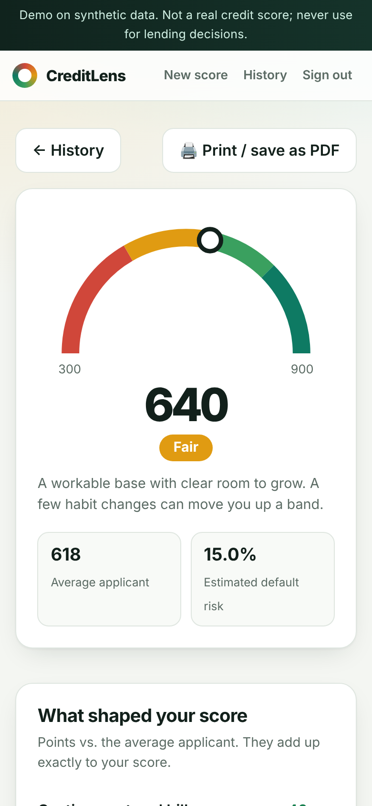

# CreditLens: explainable alternative credit score (backend + frontend)

A hackathon backend that scores students and gig workers who have no credit
history, **and tells them why**, in plain language, with a what-if simulator.

> **Demo only.** The model is trained on *synthetic* data. The output is not a
> real credit score and must not be used for lending decisions.

## How it works

```
CSV statement -> features.py (7 ratios) -> scoring.py (logistic regression -> 300-900)
                                         -> explain.py (exact per-factor points + tips)
                                         -> simulate.py (what-if re-scoring)
FastAPI routers are thin wrappers around these services; SQLite stores results.
```

**Features** (all ratios, so absolute income never matters): income consistency,
share of income saved, on-time rent/bill payments, rent-to-income, EMI burden,
spending volatility, months of history.

**Explainability.** The model is a standardised logistic regression, so exact
additive explanations (the linear-model case of SHAP) are available in closed form:
`score = baseline + sum(points_i)`. A test asserts the points add up exactly.
Tips are not canned: each tip's "+N points" comes from re-scoring with the real model.

**Score scale.** 600 points = 4:1 odds of repaying (the average synthetic applicant),
every +80 points doubles the odds, clipped to 300-900.
Bands: Poor < 500, Fair 500-649, Good 650-749, Excellent 750+.

## Quick start

```bash
python -m venv .venv && source .venv/bin/activate
pip install -r requirements.txt            # serving
export CREDITLENS_JWT_SECRET="$(python -c 'import secrets;print(secrets.token_hex(32))')"
uvicorn app.main:app --reload              # docs at http://localhost:8000/docs
```

The trained `app/ml/model.json` is included. To regenerate data and retrain:

```bash
pip install -r requirements-train.txt
python -m app.ml.make_samples              # writes data/*.csv demo personas
python -m app.ml.train                     # writes app/ml/model.json
pip install -r requirements-dev.txt
python -m unittest discover -s tests -v    # 76 tests (core, HTTP API, ingestion, offers, dashboard)
node tests/calc.test.js                    # calculator maths (no dependencies)
CREDITLENS_TEST_PG_URL=<scratch postgres url> python -m unittest tests.test_postgres   # +4 Postgres tests
```

## Frontend

`frontend/` is a dependency-free single-page app (HTML/CSS/JS, no build step). FastAPI serves it
at `/` automatically, so `uvicorn app.main:app` gives you the whole product at http://localhost:8000.
To host it separately, serve `frontend/` anywhere and open it with `?api=https://your-backend`
(and add that origin to `CREDITLENS_CORS_ORIGINS`).
Screens: **dashboard** (score, trend chart, alerts, goal plan, 30-day re-check reminder, offers preview), **score from a form**
(type in income and spending instead of uploading a CSV; per-month mode for irregular income, live ratio check),
**calculators** (EMI with prepayment, how much can I borrow, savings goal, budget check; all client-side in `calc.js`),
**offers** (loans and credit cards matched to your score), sign in/register (with live password rules) or **Try the demo** (temporary guest account),
statement upload with a **preview of how the file was understood**, score gauge, factor bars, tips,
what-if sliders (live `/simulate`), history with **compare**, printable report, erase data/delete account.








## Real bank statements

You are not limited to the template. `app/services/ingest.py` understands typical exports: other column names
(`Txn Date`, `Narration`, `Withdrawal Amt.`, `Deposit Amt.`), separate debit/credit columns, a `Dr/Cr` marker,
comma/currency-formatted amounts, `;`/tab delimiters, Windows encodings and junk lines above the header. When there is
no `category` column, rows are categorised from the description (Swiggy/Zomato, rent, SIP, EMI, ...). The
`/preview` endpoint shows exactly what was understood before anything is scored. Try
`data/bank_export_hdfc_style.csv` and `data/upi_gig_style.csv`, or download the template from the app.

More: [DEPLOY.md](DEPLOY.md) (public link or GitHub Pages, optional) and [PITCH.md](PITCH.md) (story, demo script, judge Q&A).

## API

| Method & path | Auth | Purpose |
|---|---|---|
| `GET /health` | no | liveness + model version |
| `GET /features` | no | slider metadata for the what-if UI |
| `GET /model-info` | no | metrics, bands, disclaimer |
| `POST /auth/register`, `POST /auth/login` | no | JSON `{email, password}` -> bearer token. New passwords need 8+ chars, upper, lower, number and special character (login accepts any existing password) |
| `POST /auth/demo` | no | one-click temporary guest account (purged after 24h) |
| `POST /preview` | yes | multipart `file` -> how the CSV was understood (columns, auto-categories, issues); stores nothing |
| `POST /score/manual` | yes | JSON `{months:[{income,rent,emi,bills,food,shopping,transport,subscription,other,savings}], bills_on_time_pct, consent}` (3-12 months) -> same result as a CSV score |
| `GET /dashboard` | yes | trend, goal plan, alerts, movers, offers preview in one call |
| `GET /scores/{id}/loans`, `/cards` | yes | matched loan products / card advice (optional `monthly_income`, `monthly_spend`) |
| `POST /score` | yes | multipart: `file` (CSV) + `consent=true` -> score, factors, tips |
| `GET /scores`, `GET /scores/{id}` | yes | history / one result |
| `POST /simulate` | yes | `{score_id, overrides:{feature: value}}` -> new score + delta |
| `GET /auth/me` | yes | current user's email |
| `DELETE /data?delete_account=false` | yes | erase my stored results (and optionally my account) |

CSV columns: `date, amount, category` (+ optional `due_date`, `description`).
`amount` > 0 is money in. Categories: income, rent, utilities, mobile, emi, food,
shopping, transport, subscription, savings, transfer, other. Dates may be
`YYYY-MM-DD` or day-first `DD/MM/YYYY`. See `data/*.csv` for three demo personas
(Excellent / Fair / Poor).

## Privacy and fairness choices

* The raw statement is **never stored**, only the 7 derived features and the result.
* Consent is required on every upload; `DELETE /data` erases everything.
* No sensitive attributes are collected; absolute income is not a feature
  (a test proves scaling every amount leaves the features unchanged).
* Every response carries the demo disclaimer.

## Honest limitations

* The model learns the **assumptions baked into the synthetic generator**
  (`app/ml/synthetic.py`), not real-world repayment behaviour. Reported AUC (~0.77)
  describes how well it recovers those assumptions, nothing more.
* Coefficients are sign-constrained (a feature can never be shown helping when it
  should hurt), a standard scorecard practice.
* `bill_punctuality` falls back to a neutral 0.7 when the CSV has no `due_date`
  (a warning is returned).
* Auth is minimal (access token only, no refresh). `/auth/*` has a simple per-IP in-memory rate limit
  (`CREDITLENS_AUTH_RATE`, default 10/min). With `CREDITLENS_ENV=production` the app refuses to start without a real `CREDITLENS_JWT_SECRET`.
* Storage: SQLite by default (zero setup). Set `CREDITLENS_DATABASE_URL` to a PostgreSQL URL (e.g. Neon) and the same code runs on Postgres, tested on both. See DEPLOY.md.
* Logins last 7 days (`CREDITLENS_JWT_MINUTES`) and persist in the browser until Sign out.

## Layout

```
app/main.py            app factory, CORS, startup
app/routers/           auth.py, scores.py, meta.py (thin HTTP layer)
app/schemas.py         Pydantic request/response contracts
app/deps.py            bearer-token auth dependency
app/security.py        PBKDF2 password hashing + JWT
app/db.py              data layer (SQLite or PostgreSQL)
app/services/          ingest, features, scoring, explain, simulate (all the logic)
app/ml/                synthetic generator, training script, model.json, sample maker
data/                  5 demo statements (3 template-format, 2 bank/UPI-style exports)
tests/                 test_core.py (35) + test_api.py (8) + test_ingest.py (9)
frontend/              static SPA + sample CSVs
```
